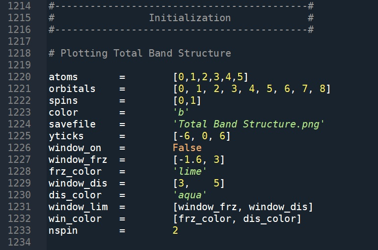

# Projected-Bands-in-Quantum-Espresso
Projected Electronic Bands in Quantum Espresso

## Requirements
###### Python\  
###### Python Libraries :\
  `numpy`\
  `sys`\
  `matplotlib`\
  `collections`\
  `scipy`\
  `os`\
  `shutil`
###### Quantum Espresso executables :\
  `pw.x`\
  `bands.x`\
  `projwfc.x`
  
## Procedure :
Currently, three types of situations are supported :\
- [x] Spin Unpolarized\
  \t Spin Polarized\
  \t Non-Collinear Spin-Orbit\
\
Make your input files in the format as provided in the examples and run the `band_projection_QE.sh` using : \
`bash band_projection_QE.sh`  command\
Or you can run in the sequence as given in `band_projection_QE.sh`\
You can change the scf.in and bands.in according to you material, but bandsx.in and projwfc.in should be as provided in the examples.
Output  files are now read in by the Python Code, run it using :\
`python band_projection_QE.py`\
Note : In case pw.x is ran on different PCs due to limitations in avabillity of processors, only files from pw.x required will be 
scf.out and bands.in, while bands.x and pojwfc.x can be run in the same folder without any processor limitations.

In the example folders, the python code is already configured, but in case of a different material, intially run the code to get the 
Total Band Structure, by commenting the line numbers 1269 to 1317. 

This prints the atom indices and orbital indices to be fed in for the projection run, the same information is saved in states.txt after
the first run. Now, in the second run, take the projections you desire to be fed in line number 1271 to 1276 after uncommenting
line number 1269 to 1317.

\

In the Second run, one gets the projection of all the atoms and orbitals ( and spins in case of Spin-Polarized ).
To get **t2g** and **eg** resolved data ( or any particular orbital projection ), change the lines from 1271 to 1276 according to the
information in states.txt.\
The Code is written in a way so that the figures can be further exported as `Matplotlib figure` and `Axes` objects.

Note  :  Actual Code in `band_projection_QE.py` statrts after line number 1230, before which are the definitions, which should not be
played with, in case of discrepencies, please contact me via commenting in this repository with your input code ( if possible ).

#### It is highly recomended to go through all the example file's inputs and `band_projection_QE.py` for each of them before running it for your material.

#### Make Sure, the Pseudopotential you use, has to contain the atomic wavefunctions in proper format. The examples have been run with PAW PBE types without pure Norm-Conserving part. The Pure Norm-Conserving Pseudopotential Files creates problems in the projwfc.x run. The Hybrid potentials like PBE, PBEsol, Ultrasoft are good Pseudopotentials for Projection purposes.

#### I will try to keep updating the code to synchronize it with new versions of Quantum Espresso.
## This code is tested in QE version 6.2, 6.4 and 6.5.
