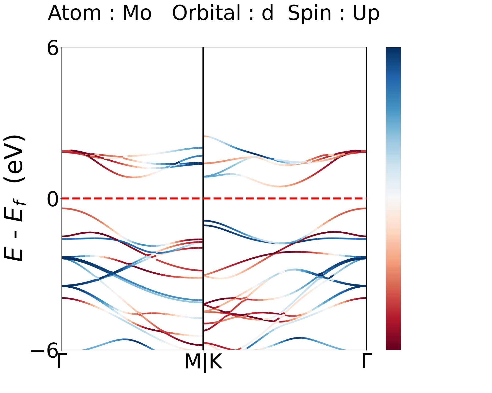

# Projected Bands in Quantum Espresso
Gives Nice plots of Atom, Orbital, and Spin projections on the Electronic Bands with MATLAB Support.

# Citation
If you are using this code, please cite
Bajaj, Naini, et al. "Sublinear temperature dependence of thermal conductivity in the incommensurate phase of TlInTe2." Physical Review B 106.21 (2022): 214101.

## Requirements
* `Python`
* `Python Libraries :`
   * `numpy`
   * `sys`
   *  `matplotlib`
   *   `collections`
   *  `scipy`
   *  `os`
   *   `shutil`
*  `Quantum Espresso executables :`
   *   `pw.x`
   *    `bands.x`
   *  `projwfc.x`
  
## Procedure :
Currently, three types of situations are supported :
- [x] Spin Unpolarized
- [x] Spin Polarized
- [x] Non-Collinear Spin-Orbit

Make your input files in the format as provided in the examples and run the `band_projection_QE.sh` using :

> bash band_projection_QE.sh

Or you can run in the sequence as given in `band_projection_QE.sh`\
You can change the scf.in and bands.in according to you material, but bandsx.in and projwfc.in should be as provided in the examples.
Output  files are now read in by the Python Code, run it in examples using :

> python band_projection_QE.py

Note : In case pw.x is ran on different PCs due to limitations in avabillity of processors, only files from pw.x required will be 
scf.out and bands.in, while bands.x and pojwfc.x can be run in the same folder without any processor limitations.

Note  :  Actual Code in `band_projection_QE.py` statrts after

***Figure : 1***

( look from the end of the file ) before which are the definitions, which should not be played with, in case of discrepencies, please contact me via commenting in this repository with your input files ( if possible ).

In the example folders, the python code is already configured, but in case of a different materials, intially run the code to get the 
Total Band Structure, by running  :

> python band_total_QE.py

***Figure : 2***

This prints the atom indices and orbital indices to be fed in for the projection run, the same information is saved in states.txt after
the first run. Now, in the second run, take the projections you desire to be fed in :

***Figure : 3***

The nspin in Figure : 2, takes the value as in scf.in :
* 1  :  Unpolarized Spin Case
* 2  :  Colinear Polarized Spin Case
* 3  :  Non-Colinear Spin-Orbit Case 

In the Second run, one gets the projection of all the atoms and orbitals ( and spins in case of Spin-Polarized ).
To get **t2g** and **eg** resolved data ( or any particular orbital projection ), change the lines in Figure : 3 according to the information in states.txt and run

> python band_projection_QE.py

The Code is written in a way so that the figures can be further exported as `Matplotlib figure` and `Axes` objects.

Note  :  Wannier Window visualization is also supported due to my current work in the same. Examples are in Spin_Orbit\Pt. All datas extracted from Quantum Espresso Outputs are exported in MATLAB .mat format by Default. This enables plotting the graphs in MATLAB as well ( See example  Spin-Unpolarized\MoS2\Continnious_bands\MATLAB_OUTPUT ).

Note  :  Not all the figures created are actual projections, for example, in Spin_Polarized/FeO/Figure, Fe p-orbitals and O d-orbitals are empty ( or shows only one band occupied due to auto-normalization in python matplotlib ). Since this orbital wavefunctions are not stated in their pseudo-potential files, hence their are no contributions in electronic ennergies, but for the sake of even number of arrays supported by numpy, the code also has spaces to occupy those weights ( which are nothing but zeros ).

It is highly recomended to go through all the example file's inputs and `band_projection_QE.py` for each of them before running it for your material.

Make Sure, the Pseudopotential you use, has to contain the atomic wavefunctions in proper format. The examples have been run with PAW PBE types without pure Norm-Conserving part. The Pure Norm-Conserving Pseudopotential Files creates problems in the projwfc.x run. The Hybrid potentials like PBE, PBEsol, Ultrasoft are good Pseudopotentials for Projection purposes.

I will try to keep updating the code to synchronize it with new versions of Quantum Espresso.
#### This code is tested in QE version 6.2, 6.4 and 6.5 and Python version 3.8.3.
***** Please provide your input files for any issues faced.*****

## References
* P. Giannozzi, O. Baseggio, P. Bonfà, D. Brunato, R. Car, I. Carnimeo, C. Cavazzoni, S. de Gironcoli, P. Delugas, F. Ferrari Ruffino, A. Ferretti, N. Marzari, I. Timrov, A. Urru, S. Baroni; J. Chem. Phys. 152, 154105 (2020) https://doi.org/10.1063/5.0005082.
* Uthpala Herath, Pedram Tavadze, Xu He, Eric Bousquet, Sobhit Singh, Francisco Muñoz, and Aldo H. Romero. "PyProcar: A Python library for electronic structure pre/post-processing". Computer Physics Communications 251 (2020): 107080.
* https://matplotlib.org/3.1.1/gallery/lines_bars_and_markers/multicolored_line.html
